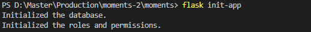
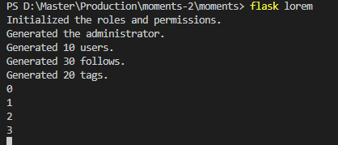
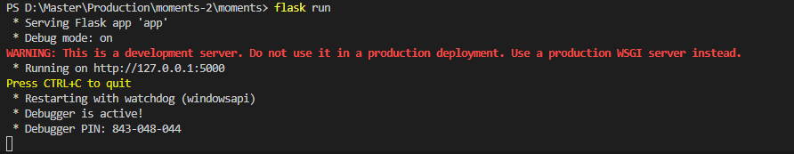
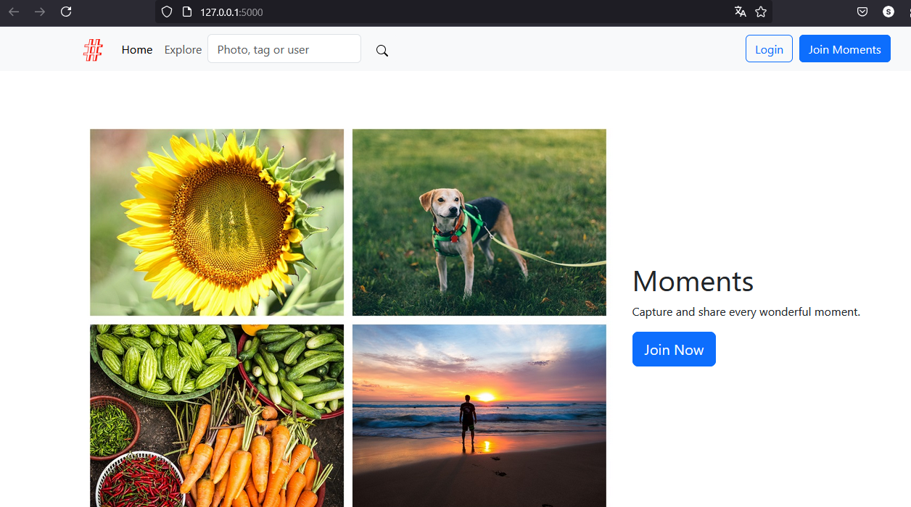
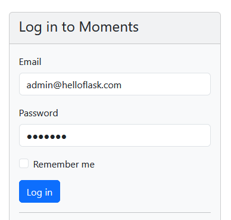
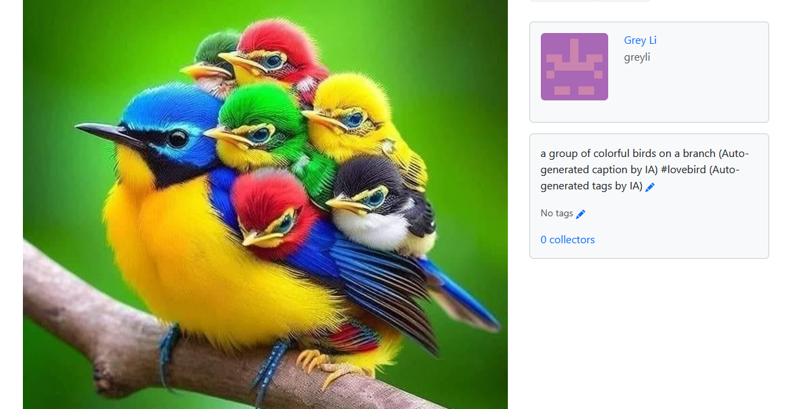

# Moments

A photo sharing social networking app built with Python and Flask. The example application for the book *[Python Web Development with Flask (2nd edition)](https://helloflask.com/en/book/4)* (《[Flask Web 开发实战（第 2 版）](https://helloflask.com/book/4)》).

Demo: http://moments.helloflask.com


## Installation

Clone the repo:

```
$ git clone https://github.com/greyli/moments
$ cd moments
```

Install dependencies with [PDM](https://pdm.fming.dev):

```
$ pdm install
```

> [!TIP]
> If you don't have PDM installed, you can create a virtual environment with `venv` and install dependencies with `pip install -r requirements.txt`.

To initialize the app, run the `flask init-app` command:

```
$ pdm run flask init-app
```

If you just want to try it out, generate fake data with `flask lorem` command then run the app:

```
$ pdm run flask lorem
```

It will create a test account:

* email: `admin@helloflask.com`
* password: `moments`

Now you can run the app:

```
$ pdm run flask run
* Running on http://127.0.0.1:5000/
```

## License

This project is licensed under the MIT License (see the
[LICENSE](LICENSE) file for details).

# Important
- Install azure.ai.vision.imageanalysis
- Set up your variables in the environment
- The IA generated content will appear only with no-caption images


# Notes for Production Deployment class

Please check the commits made specifically for this class.

Steps to deploy:

- (Optional) Create a virtual environment with Python3
- Install `requirements.txt` dependecies
- Additionally, install `azure-cognitiveservices-vision-computervision` and `azure-ai-vision-imageanalysis`
```bash
$ pip install --upgrade azure-cognitiveservices-vision-computervision
$ pip install azure-ai-vision-imageanalysis
```
- Init the app and run
```bash
$ flask init-app
$ flask lorem
$ flask run
```




- The app will be open in port `5000` by default


- Let's use the credentials to login
* email: `admin@helloflask.com`
* password: `moments`


- Add a image by using the + sign in the top-right corner, select the image nad upload. Once done, open the image and check the content generated at the right of the picture

